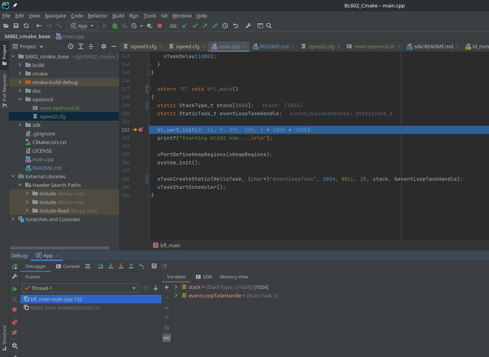

# bl602_cmake_base
CMake project for BL602 RISC-V processor

# How to build
*NOTE :* This project uses a pre-compiled version of the [Buffalo SDK (bl_iot_sdk)](https://github.com/bouffalolab/bl_iot_sdk) located in the folder **sdk**.

Create a build directory and run CMake:

```
mkdir build
cd build
cmake -DRISCV_TOOLCHAIN_BIN_PATH=<path_to_the_riscv_toolchain> ..
make
```

The files `BL602_Cmake.bin`, `BL602_Cmake.out` and `BL602_Cmake.hex` are generated.

You can use a [flasher for the BL602](https://github.com/mkroman/awesome-bouffalo#rom-tools) to flash the firmware to the BL602 using the USB-To-Serial port. 

# How to flash
As far as I know, it's not possible to flash the firmware using OpenOCD and a JTAG adapter. You can still flash the board using the bootlaoder, over a serial port.

Example using **blflash**
```
blflash-linux-amd64 flash build/BL602_Cmake.bin  --port /dev/ttyUSB2
```

# How to debug using OpenOCD and GDB
This project provides a configuration file for the Sipeed JTAG adapter.

 * Start OpenOCD:
```
openocd -f openocd/sipeed.cfg
```

 * Start GDB:

```
$ /home/jf/bl602/riscv64-unknown-elf-gcc-10.1.0-2020.08.2-x86_64-linux-ubuntu14/bin/riscv64-unknown-elf-gdb ./build/BL602_Cmake.out
```

Here's the output of this command
```
GNU gdb (SiFive GDB 9.1.0-2020.08.2) 9.1
Copyright (C) 2020 Free Software Foundation, Inc.
License GPLv3+: GNU GPL version 3 or later <http://gnu.org/licenses/gpl.html>
This is free software: you are free to change and redistribute it.
There is NO WARRANTY, to the extent permitted by law.
Type "show copying" and "show warranty" for details.
This GDB was configured as "--host=x86_64-linux-gnu --target=riscv64-unknown-elf".
Type "show configuration" for configuration details.
For bug reporting instructions, please see:
<https://github.com/sifive/freedom-tools/issues>.
Find the GDB manual and other documentation resources online at:
    <http://www.gnu.org/software/gdb/documentation/>.

For help, type "help".
Type "apropos word" to search for commands related to "word"...
Really redefine built-in command "remote"? (y or n) [answered Y; input not from terminal]
No symbol table is loaded.  Use the "file" command.
Make breakpoint pending on future shared library load? (y or [n]) [answered N; input not from terminal]
/home/jf/.gdbinit:24: Error in sourced command file:
The program is not being run.
Reading symbols from ./build/BL602_Cmake.out..
```

 * Connect to OpenOCD:
```
(gdb) target extended-remote :3333
Remote debugging using :3333
0x23000348 in vApplicationIdleHook () at /home/jf/git/bl602_cmake_base/main.cpp:63
warning: Source file is more recent than executable.
63        __asm volatile(
(gdb) 
```

You can now debug your firmware using GDB!

# How to debug using CLion

 * Create a **GDB Remote Debug** configuration : 


 * Add an external tool that will be launched before starting the debugging. This tool will call `openocd/reset-openocd.sh` to reset the MCU when a new debugging session is started. Click on the '+' button under *Before launch* and select *run external tool*:


You can now hit the **Debug** button in CLion. It'll connect to OpenOCD, reset the MCU and start GDB. You can add breakpoints in CLion and do step by step debugging as usual:




